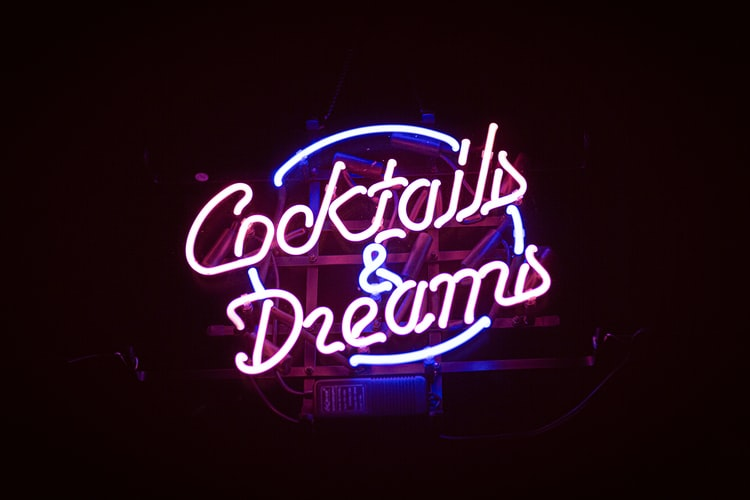

# Cocktails and Dreams

## Table of Contents
1. Project purpose and introduction
2. UXD – User Experience Design
3. Features
4. Technologies and Resources used
5. Testing
6. Project barriers and solutions
7. Version Control
8. Deployment
9. Credits
10. Acknowledgments

# 1. Project purpose and introduction

[**View the live project here**](https://maggiedaisy.github.io/Cocktails-and-Dreams/)

# 2. UXD – User Experience Design

### **User Stories**

as a user of ,,,,,,,,,,,

### **Strategy**

### **Scope**

### **Structure**

### **Skeleton**

[**Wireframes:**](/assets/docs/...........pdf)

### **Surface**

# 3. Features

### Existing Features

### Features left to implement when skills developed

# 4. Technologies and Resources used 
* [**Code Institute Fullstack Web Developer Course Content**](https://codeinstitute.net/) - was used as the main source of fundamental knowledge and inspiration.
* [**Code Institute „SLACK” Community**](https://slack.com/intl/en-no/) - was used as a source of assistance.
* **HTML - HTML5 technology** – was used as the main language to create the structure of the Website.
* **CSS - CSS3 technology** – was used as the main language to style the Website.
* **JS - JavaScript technology** – was used as the main language to create the interactive elements of the Website.
* **Python+Flask technology** - 
* **MongoDB** - was used as a source-available cross-platform document-oriented database program for storing information 
* [**Materialize**](https://materializecss.com/) - Materialize front-end framework was used as an open-source to create responsive features and modern design of the Website.
* [**jQuery**](https://jquery.com/) - jQuery library was used as an open-source to create interactive features.
* [**Font Awesome**](https://fontawesome.com/) - Font Awesome Icons were used for social media links and marking separate parts of sections.
* [**Google Fonts**](https://fonts.google.com/specimen/Inconsolata) - Google Font used throughout this project was 'Inconsolata'.
* [**Gitpod**](https://www.gitpod.io/) - Integrated Development Environment was used to develop the Website.
* [**GitHub**](https://github.com/) - GitHub hosting site was used to store the source code for the Website, and Git Pages was used for the deployment of the live version of site.
* [**Git**](https://git-scm.com/) - Git was used as version control software to commit and push code to the GitHub repository where the source code is stored.
* [**Google Maps JavaScript API**](https://developers.google.com/maps) - was used to display a map on the page with markers for main attractions.
* [**EmailJS**](https://www.emailjs.com/) - was used to send an email to the site of the agency right after submission of the contact form.
* [**Stack Overflow**](https://stackoverflow.com/) - was used as a general source of knowledge.
* [**w3schools**](https://www.w3schools.com/howto/default.asp) - especially section 'How to' was used as a general source of knowledge.
* [**Google Chrome Developer Tools**](https://developers.google.com/web/tools/chrome-devtools) - this built-in developer tool was used to inspect page elements and help debug issues with the site layout and test different CSS styles and console JS.
* [**Mobile-Friendly Test Tool**](https://search.google.com/test/mobile-friendly) - The Mobile-Friendly test tool was used to check if aplication is designed for mobile devices.
* [**Balsamiq Wireframe**](https://balsamiq.com/wireframes/) - these quick and handful tool was used to create wireframes for planning project structure and layout.
* [**Am I Responsive Bookmarklet**](http://ami.responsivedesign.is/) - Multi Device Website Mockup Generator was used to create the Mockup image for this README file.
* [**Make a README**](https://www.makeareadme.com/) – a page that shows suggestions on how to create a good Readme file.
* [**Mastering Markdown**](https://guides.github.com/features/mastering-markdown/)– GitHub guide about Markdown. Lightweight and easy-to-use syntax for styling all forms of writing on the GitHub platform.
* [**W3C Markup Validation Service**](https://validator.w3.org/) - validator was used to check the markup validity of content in HTML and CSS.
* [**JSHint**](https://jshint.com/) - was used as tool that helps to detect errors and potential problems in JavaScript code.
* [**Closing Tag Checker for HTML5**](https://www.aliciaramirez.com/closing-tags-checker/) - was used to validate if all tags are open and close correctly.
* [**HTML and CSS and JS Formatter**](https://webformatter.com/html) - was used to beautify code.
* [**MS2 Lead Call**](http://bit.ly/ms2_call_aukje) - Zoom session about planning Milestone Project 2, recorded and posted on Slack by Aukje van der Val  - was used to structure planning steps for this project.
* [**Bootstrap Essentials**](https://ajgreaves.github.io/bootstrap-grid-demo/index.html) - Page developed by Anna Greaves - was used as a source for a better understanding of the grid system.
* [**Grammarly**](https://app.grammarly.com/) - a comprehensive writing tool was used as a helper to write clear and correct text.
* [**iColorpalette**](https://icolorpalette.com/) - has been used as a color picker to create a layout on the Website.
* [**GIMP**](https://www.gimp.org/) - GNU Image Manipulation Program (GIMP) has been used as free & open source image editor to create a logo of the Web.
* **Microsoft Paint** - a simple raster graphics editor has been used for editing and resizing pictures.
* [**FaviconeCodeGenerator**](https://www.faviconcodegenerator.com/) - Favicon Code Generator is Free Online Favicon Converter and has been used to create a little graphic image (icon) associated with a webpage.
* [**MDN Web Docs**](https://developer.mozilla.org/) - documentation repository and learning resource for web developers has been used as a general resource.

# 5. Testing

The final result of this project is a front-end and back-end web application based on the principles of user experience design, accessibility, and functionality. 
**This is an interactive front-end and back-end web application developed and implemented by using HTML, CSS, JavaScript, Python+Flask, MongoDB with additional Materialize and jQuery elements**, so required testing was conducted based on visual effects, website layout and interactive actions which user can take it during navigation.

**General manual and further testing results:** ---> please click [here](tests.md)

> Answering to a user story needs: 

# 6. Project barriers and solutions

# 7. Version Control

**Git** - free and open-source distributed **Version Control System** was used to show tracking all changes during the coding process. 
`Git add -A`, `Git commit -m`, `Git push` commands were used to approve and store files in the repository. 

# 8. Deployment

# 9. Credits

> Content

The text content for this page was created by student Malgorzata Czerwonka (self-written) for a **non-existing company**, and for **educational purposes only**. Inspiration to create informative and consistent content was borrowed from following sources:
- [**The Bar Cabinet**](https://thebarcabinet.com/) - The International Bartenders Association Official Cocktail List

> Media

All the images used in this site were picked from:

- [**Unsplash**](https://unsplash.com/) - a website dedicated to sharing stock photography for free for every kind of project

- [**Pixabay**](https://pixabay.com/) - a stunning free images & royalty free stock

- [**FAVPNG**](https://favpng.com/png_view/cocktail-cocktail-juice-margarita-drawing-png/Csp3tQ3K) - a database of free transparent PNG Images 

> Code

- Code inspiration for ....  borrowed from - [** Responsive **](https ?????)

# 10. Acknowledgments

- Inspiration for this project was the walkthrouh mini project "Task Manager" 
- I would like to thank: 
    - Code Institute tutors for creating inspiring content for the course and support during learning process,
    - Slack Community for being available and helpful every single time when needed, 
    - especially students and leaders like Edd for constructive zoom session about how to approach MS3, 
    - and Harry for discussing issues about database and planning project 
    - and last but not least my mentor Sandeep Aggarwal for his guidance, patience, and effort during the development process

