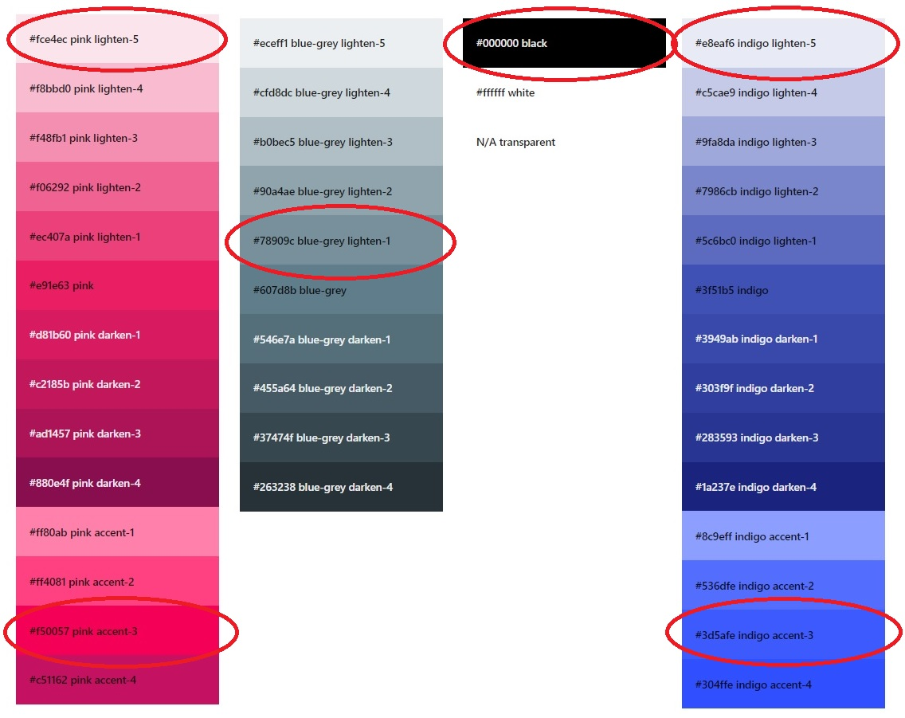

# Cocktails and Dreams

## Table of Contents
1. Project purpose and introduction
2. UXD – User Experience Design
3. Features
4. Technologies and Resources used
5. Testing
6. Project barriers and solutions
7. Version Control
8. Deployment
9. Credits
10. Acknowledgments

# 1. Project purpose and introduction

This project was created to demonstrate the acquisition of broader coding skills as part of the Code Institute Fullstack Web Developer Course. Technologies used during the application development process are mainly: HTML, CSS, JavaScript, Python+Flask, MongoDB with an additional framework such as Materialize and library such as jQuery. This project aims to create a full-stack website that will allow the user to add information and search for information.

# Cocktails and Dreams

[**View the live project here**](https://cocktails-and-dreams-m.herokuapp.com/)

Cocktails & Dreams is a full-stack application that allows users to manage a dataset about this domain. The purpose of this app is to demonstrate basic cocktails classic recipes, add new dream recipes, and search for existing ones by name or ingredient. This app can benefit cocktails enthusiasts who like to experiment with mixing ingredients and professional bartenders who can provide officially approved pieces of information. The website offers the possibility to users to share their data with the community and benefit from having convenient access to the data provided by all the members. This website is designed in such a way that the user can check it at any time, on the phone on the road, or at home on the computer. The project may be expanded in the future with other, more detailed sections.

# 2. UXD – User Experience Design

### **Strategy**

Potential users of this application are users who have a professional and hobbyist interest in cocktails mixology. The site can be very handy for users with basic skills who are looking for approved classic recipes, freestyle ones, and for new dream inspirations. The site will benefit also users who have already professional skills in bartending and want to share their own idea and get some new fresh overview for other users' recipes. 

### **User Stories**

- As a user of a website, I wish to be able to navigate through very easily, so I can find interesting content
- As a user of the website, I wish to be able to understand the purpose of the application, so I can gain brief orientation about what I can achieve by using it
- As a user of the website, I want to have access to the register field, so I can easily create my profile account
- As a user of the website, I wish to find different cocktail recipes, so I can satisfy my interest in that matter
- As a user of the website, I wish to have visible access to social media, so I can follow after site owners/admin
- As a user of the website, I wish that design is responsive, so I can look at the page on different size of devices
- As a user of the website, I wish to log in with my username and password, so I can have easy access to the full content of the site 
- As a user of the website, I wish to have the possibility to create my dream cocktail recipe, so I can share it with others in the community 
- As a user of the website, I wish to have the possibility to edit or delete my dream cocktail, so I can correct or remove the content 
- As a user of the website, I wish to have the possibility to view my profile, so I can see recipes I added to the app 
- As a user of the website, I wish to log out from my profile, so I can protect my data

### **Scope**

Current and further developing and designing skill ability, the website provides:
- Clean User Experience by using technologies mentioned in the introduction - HTML, CSS, JavaScript, Python+Flask, MongoDB 
- Easy and intuitive navigation via the navbar, and toggle button 
- Informative content builds to give a clean and modern impression of the purpose of the website 
- Responsive design allows navigating on different devices
- Interactive features which are focused on providing a functional and appealing space for the user
- Landing page with the hero image, introduction paragraph, small showcase of a gallery, and dropdown with categories
- Pieces of key information about the basic selection of classic cocktails recipe
- Clear and simple searching bar to browse cocktails recipes 
- Informative and simple steps of creating a profile 
- Clean information on how to log in and use the profile 
- The simple mean of how to create, add, edit and delete a dream cocktail recipe
- Log out feature possibility should be provided 
- Footer with social media icons to link to their sites

### **Structure**

The structure of the application is based on meeting the first needs of the potential user. The website is simple structured, learnable, and intuitive, the first interaction enables the quick and easy finding of information and orientation between features and theme. The text content is short and consistent and the imagery is simple and clean, both describe the purpose and aim very well. All sections allow the user to interact with the site using built-in functions.

All users of the website should be able to see the navigation bar, with clickable options, clear and modern content, and a footer with SM icons. The visual impression and design should be also consistent across all pages of the app.
- Navigation Bar on the top of the page which is consistent  - contains names of each site page for browsing easily between them, site logo which acts as a link to the main page, toggle button visible on smaller devices, and icon matching the theme
- Home Page - contains a short introduction, small carousel gallery, dropdown menu with cocktails categories, and hero images for a better presentation of the aim of the site
- Cocktails Collection Page - contains card panels with the presentation of 9 basic cocktails and 'Show Recipe' button which is clickable for the further view of full recipe description, search bar with the ability to search for the name of cocktail or ingredient
- Register Page - contains two fields to fill up with 'Username' and 'Password' and a 'Register' button, and a link to the 'Log In' Page
- Log In Page - contains two fields to fill up with 'Username' and 'Password' and a 'Login' button, and a link to the Register Page
- Add Dream Recipe Page - contains a form available to fill out with the cocktail recipe fields like 'Category', 'Name', 'Description', 'Ingredients', 'Steps' 'Tools', 'Picture' and 'Submit' button, this page is available only for registered users
- Profile Page - contains information about user and history uploaded recipes, this page is available for registered users, the dream recipe uploaded by the user contains a button for 'Edit' and 'Delete' the recipe
- Log Out link - allows user to log out from the profile to protect a data
- Footer on the bottom of the page which is also consistent - contains icons that act as a link to SM platforms

### **Skeleton**

[**Wireframes:**](/assets/docs/wireframes/sketchMS3.pdf)

A website with 7 different separate content pages and the possibility to navigate between them
- Header – fixed navigation bar with brand name and clickable links
- 7 main sections called:
    - Home, 
    - Cocktails Collection, 
    - Register, 
    - Log In, 
    - Add Dream Recipe, 
    - Profile, 
    - Log Out 
- Footer – footer with social media icons and copyright

[**Database:**](/assets/docs/database/mongodb.pdf)

A database MongoDB consists of 3 collections called:
- categories
- recipes
- users

### **Surface**
The visual experience of this project reflects the theme of colorful cocktails, retro and flashy neon design
> Colors

A blend of dark and strong neon colors reflecting the colors of retro bar and old school disco atmosphere. Throughout the whole project were used 5 main colors and their shades, picked from MaterializeCSS Color Palette
- pink - #f50057 pink accent-3 and #fce4ec pink lighten-5
- black - #000000 black
- blue - #3d5afe indigo accent-3 and #e8eaf6 indigo lighten-5
- grey - #78909c blue-grey lighten-1
- additional to underline flash messages and icons - flashy yellow/green - rgba(66, 251, 5)

> Typography

Font 'Arvo' was used for the clean and transparent experience for the whole body content. Selected from Google Fonts after recommendations other users as an elegant font. This specific one is good for clear readability and the professional layout of the recipe project.

> Icons 

Icons for Log In, Register, Add Recipe Form, Edit and Delete buttons and Social Media logos picked from Font Awesome free collection, the web's most popular icon set and toolkit. 

> Images

The selection of images for the carousel and card panels with recipes has been made to present specific cocktails. Imagery presentation shows to users the exact theme of the website making it understandable from the first impression.
Hero images on the Home Page reflect colorful neon lights that bring atmosphere from the cocktail bar.
Imagery collections were picked from Unsplash and Pexels.

# 3. Features

> Existing Features

Existing features on the site were created for making the User's Experience easy and intuitive. Application is clear to understand, as a first visible is the purpose of the website which is reading, creating, storing, and sharing recipes with others. Space created for users is very simple and comfortable, all features are clearly specified and pointing users to take further steps. The navigation bar and footer are consistent and act as a fixed component on every page which makes navigation smooth. Name of separate pages acts as active links and brings users to different parts of content and experiences. 

- **Top Navigation Bar**
  - The fixed navigation bar located at the top of the page shows on all site pages on every size of the device. Navbar allows users to easily browsing through the site and making sure that users can enter every part of the application from this place. Navbar menu is responsive and on small size deices collapse to a button. 
  - The left side contains a logo icon that matches the theme of the application, and the logo brand name which acting as a link to the 'Home' Page.
  - The right side contains all names of every single page and acts as links to specific content. Some of the pages are only visible and accessible to logged-in users, like 'Add Dream Recipe' and 'Profile'.

- **Home Page**
  - The Home Page contains 2 hero images, one on the top and one on the bottom, to give a general impression of the theme of the site
  - It also contains a short section that acts as an introduction to the purpose of this app, so that a user can know already if this is the place to be
  - A little Carousel with images shows examples of cocktails, neons, and bars, and encourages users to be creative after seeing this visual effect
  - This page contains also a dropdown showcase with 5 cocktail categories, which presents category names and short category descriptions. First, 4 top categories can not be modified because they were created after strict international categorization. For better comfort of user experience, the 5 category was added as a freestyle option, so users can include every recipe which not match standard categorization. Categories can not be changed or added, they cover the needs of creating recipes in this field
  - A link to Add Dream Recipe lays on top of the second hero picture in button form. If a user is logged in, this link will bring him directly to Add Dream Recipe page. If a user is not logged in, the button heads actually to Log In page first, where the user can log in to an account (for existing users) or go alternatively to the Register link provided (for new users). After filling up all requirements, the user can start to browse the page fully.
  - A link to view all Cocktail Collection is provided in the main navigation menu which acts as a handy tool stuck to the top of the page 

- **Cocktails Collection Page**
  - On top of the page, a 'Search' bar is placed allowing users to search for a cocktail name or any cocktail ingredient
  - All recipes on this page appear as a collection of card panels.
  - Every card panel displays the cocktail image on top, cocktail category on the left, cocktail name in the middle, and the 'Show Recipe' button on the right
  - After clicking this button user can see the backside of the card panel with the full recipe and close button, card presents the name, description, ingredients, steps, tools and shared by fields 
  - All users/viewers, who are not logged in or registered, can see a collection of card panels only as a reading display.
  - When the current user is the author of any of those cocktail recipes included in the whole collection, can actually see clickable buttons for 'Edit' and 'Delete' that specific cocktail.

- **Add Dream Recipe Page**
  - This page is only accessible to users who have an account and are logged in
  - Contains a form with fields. The first one with a dropdown that selects the possibility to 'Choose Cocktail Category' from 5 provided categories. Next fields to fill up with 'Cocktail Name', 'Little Description', 'Ingredients and Measurements', 'Steps To Take', 'Necessary Tools', 'Cocktail Picture'  for URLs input
  - Every field contains a label and icon for a better explanation of how to fill the form and visual experience which will match the same fields on the card panels later on
  - Fields are marked as required and when the user will click on a submit button on the bottom, and the form is not properly filled, the user will be alerted about filling the form correctly and not leaving empty fields.
  - The 'Add Recipe' button will add a cocktail recipe to a database and bring the user to the 'Cocktails Collection' page. User will receive an alert about the successful addition of a recipe. A card panel with a new cocktail recipe will be visible now in the collection.

- **Edit Recipe Page**
  - This page is available only to the author of the recipe.
  - To enter this feature is possible from the card panel recipe from the "Profile' page and the 'Cocktail Collection" page by using the button 'Edit' on the bottom of a recipe, which brings the user to this page.
  - Edit recipe appears as a separate page, that returns a pre-filled form with all the values of the recipe, that the user entered during creating process. Here user can correct the content of the recipe, and use two buttons, in case of the desire for editing or deletion
  - Button 'Edit Recipe' - located on the bottom of the form, will edit the recipe and send the author to 'Cocktails Collection' and show an alert that the recipe was successfully edited. Button 'Cancel' - will return the author to the 'Cocktails Collection' page if he decides not to make any changes in a recipe and leave the page.
  - Button 'Delete' located on the bottom of recipe triggers instead of a safety purposed modal, which returns an alert message if an author is sure that wants to delete this recipe for good and protects from unwanted deletion. Alert gives two button options, a 'Cancel' which will close the modal and return author back to the card panel, and 'Delete' which will delete a recipe from collection and database and return alert about successfully deletion process and brigs author to 'Cocktails Collection' page

- **Register Page**
  - A page with form fields for 'Username', 'Password',  and a 'Register' button is available for not logged in, and new users. Input fields contain labels that inform users about the correct text format acceptable for insertion. If fields are filled incorrectly or left empty, then the user will receive an alert about that. If a username exists in the database then will receive a flash message that the username has been already taken.
  - This page provides, under the form, alternatively link to the Log In page for the users who have been already created an account.
  - When input fields are properly filled and the 'Register' button is clicked, the user will be brought to the 'Profile' page and receive an alert about confirming their registration.

- **Login Page**
  - A page with form fields for 'Username', 'Password',  and a 'Log In' button is available for existing but not logged-in users. Input fields contain labels that inform users about the correct text format acceptable for logging in. If fields are filled incorrectly or left empty, then the user will receive an alert about that. If a username does not exist in the database or is incorrect then will receive a flash message. 
  - This page provides, under the form, alternatively link to the Register page for the users who do not create an account yet. 
  - When input fields are properly filled and the 'Login In' button is clicked, the user will be brought to the 'Profile' page and receive an alert about confirming their logging in process.

- **Profile Page**
  - The 'Profile' page is only available to register and logged-in users.
  - On the top of the page, a visible card panel with welcoming text and username.
  - Collection of cocktail recipes created only by the author are displayed under the welcoming card panel. Panels are provided the same way like on the 'Cocktails Collection' page and allow the author for editing and deleting own recipes. 

- **Log Out**
  - The 'Log Out' link successfully logs the user out from his profile page. That provides security to protect data recipes created by this user. 

- **Footer**
  - Contains Social Media icons that act as links for Facebook, Instagram, and YouTube and bring the user to the main platforms. In the future should bring the user to real social media provided by the community. Links open in a new tab so that the user can smoothly navigate back to the application. 

> Features left to implement in the future when skills developed

- An interesting feature would be to create a rating recipe option, so users can give themselves a general score for the content and idea, like stars for cocktails. 
- Another one could be the ability to add comments for recipes or even create a sort of forum, where users can discuss the recipes, details, give feedback and participate in the life of the website being a part of the community. 
- Going further after this thought would be a possibility to create a space for saving and exchanging recipes with another user
- Later on, when the application will grow up would be necessary to add an administration page, which will allow controlling all of the input content added by users. For the current stage of the application, the admin can add, correct and delete content by using a database where all information is stored. 

# 4. Technologies and Resources used 
* [**Code Institute Fullstack Web Developer Course Content**](https://codeinstitute.net/) - was used as the main source of fundamental knowledge and inspiration.
* [**Code Institute „SLACK” Community**](https://slack.com/intl/en-no/) - was used as a source of assistance.
* **HTML - HTML5 technology** – was used as the main language to create the structure of the Website.
* **CSS - CSS3 technology** – was used as the main language to style the Website.
* **JS - JavaScript technology** – was used as the main language to create the interactive elements of the Website.
* **Python technology** - was used as an interpreted high-level general-purpose back end programming language
* [**Flask**](https://www.fullstackpython.com/flask.html) - a lightweight WSGI web application framework
* [**Jinja**](https://jinja.palletsprojects.com/en/3.0.x/) - a web template engine for the Python programming language
* [**MongoDB Atlas Database**](https://www.mongodb.com/cloud/atlas1)- was used as a source-available cross-platform document-oriented database program for storing information 
* [**Materialize**](https://materializecss.com/) - the MaterializeCSS front-end framework was used as an open-source to create responsive features and modern design of the Website.
* [**jQuery**](https://jquery.com/) - the jQuery library was used as an open-source to create interactive features.
* [**Font Awesome**](https://fontawesome.com/) - Font Awesome Icons were used for social media links and marking separate parts of sections.
* [**Google Fonts**](https://fonts.google.com/specimen/Inconsolata) - Google Font used throughout this project
* [**Gitpod**](https://www.gitpod.io/) - Integrated Development Environment was used to develop the Website.
* [**GitHub**](https://github.com/) - GitHub hosting site was used to store the source code for the Website, and Git Pages was used for the deployment of the live version of site.
* [**Git**](https://git-scm.com/) - Git was used as version control software to commit and push code to the GitHub repository where the source code is stored.
* [**Heroku**](https://www.heroku.com) - Cloud Application Platform is a service (PaaS) that enables developers to build, run, and operate applications entirely in the cloud
* [**Stack Overflow**](https://stackoverflow.com/) - was used as a general source of knowledge.
* [**w3schools**](https://www.w3schools.com/howto/default.asp) - was used as a general source of knowledge.
* [**Google Chrome Developer Tools**](https://developers.google.com/web/tools/chrome-devtools) - this built-in developer tool was used to inspect page elements and help debug issues with the site layout and test different styles
* [**Mobile-Friendly Test Tool**](https://search.google.com/test/mobile-friendly) - The Mobile-Friendly test tool was used to check if an application is designed for mobile devices.
* [**Balsamiq Wireframe**](https://balsamiq.com/wireframes/) - these quick and handful tool was used to create wireframes for planning project structure and layout.
* [**Am I Responsive Bookmarklet**](http://ami.responsivedesign.is/) - Multi Device Website Mockup Generator was used to create the Mockup image for this README file.
* [**Make a README**](https://www.makeareadme.com/) – a page that shows suggestions on how to create a good Readme file.
* [**Mastering Markdown**](https://guides.github.com/features/mastering-markdown/)– GitHub guide about Markdown. Lightweight and easy-to-use syntax for styling all forms of writing on the GitHub platform.
* [**W3C Markup Validation Service**](https://validator.w3.org/) - validator was used to check the markup validity of content in HTML and CSS.
* [**JSHint**](https://jshint.com/) - was used as tool that helps to detect errors and potential problems in JavaScript code.
* [**PEP8 online**](http://pep8online.com/) - was used as tool check the code for PEP8 requirements
* [**Closing Tag Checker for HTML5**](https://www.aliciaramirez.com/closing-tags-checker/) - was used to validate if all tags are open and close correctly.
* [**HTML and CSS and JS Formatter**](https://webformatter.com/html) - Free online tool to format an ugly HTML code, making it readable and pretty, with the proper indentation.
* [**Black**](https://black.vercel.app/) - The uncompromising Python code formatter.
* [**MS3 Strategy and Tips**](https://us02web.zoom.us/rec/play/Oue_1UJem3uxbPmzdT40ysKMOh4urdHf2M7ABy0zoHTGubzwWXedDZ31n1HOF0WwVNwYg34X_qrKcfiQ.FiJ8qeUidncmPnYi) - Zoom session about planning Milestone Project 3, recorded and posted on Zoom by Ed Bradley was used to structure planning steps for this project.
* [**Grammarly**](https://app.grammarly.com/) - a comprehensive writing tool was used as a helper to write clear and correct text.
* **Microsoft Paint** - a simple raster graphics editor has been used for editing and resizing pictures.
* [**FaviconeCodeGenerator**](https://www.faviconcodegenerator.com/) - Favicon Code Generator is Free Online Favicon Converter and has been used to create a little graphic image (icon) associated with a webpage.
* [**MDN Web Docs**](https://developer.mozilla.org/) - a documentation repository and learning resource for web developers has been used as a general resource.

# 5. Testing

The final result of this project is a full-stack, front-end and back-end web application based on the principles of user experience design, accessibility, and functionality. 
**This is an interactive front-end and back-end web application developed and implemented by using HTML, CSS, JavaScript, Python+Flask, MongoDB with additional Materialize and jQuery elements**, so required testing was conducted based on functionality for getting and storing data, visual effects, website layout, and interactive actions which user can take it during navigation.

**General manual and further testing results:** ---> please click [here](tests.md)

> Answering to a user story needs: 

- Tests made on the top located navigation bar shown that every person visiting the site will be able to navigate very easily between sections to find pieces of information. Clickable links are bringing the user to different pages. The navigation bar with active links is available all the time on top of the page, so it is easy to switch and back to desirable content.
- Tests made on the separate pages shown that users will be able to learn about the application very fast. The 'Home' - landing page contains very intuitive information and shows the purpose of the website.
- Tests made on the 'Register' page shown that all process is very easy and quick and does not require a lot of data to have access to the full content of the application. Profile account can be created in 3 steps, by entering Username, Password, and click on submit button. 
- Test made on The 'Cocktails Collection' page which presents card panels with separate recipes is very clear and meets the users expectation. Each card panel contains clickable buttons, a picture of the cocktail, name, description, ingredients, tools, and steps. 
- Tests made on footers social media icons allows user to find visible and easy access to social media. Clickable links are giving the user possibility to observe and join the community of bartenders.
- Tests made on different screen sizes show that the application is responsive, so the user can look at the page on different devices.
- Tests made on the 'Log In' page has shown that existing user has very simple access to the full content of the page.  Similar to registration, logging in takes only 3 steps, so makes access very smooth and fast. 
- Tests made on the 'Add Dream Recipe' page shown that users have a great possibility to create and add their own recipes. The page contains a simple form with intuitive icons and input fields, everything is presented clearly so the users can be creative and share ideas not using much time on it. 
- Tests made on the 'Edit' recipe page confirm that registered and logged-in users can easily navigate between their dream recipes.  Authors can edit a recipe, correct the content or category or picture, or just delete it from the collection. 
- Tests made on the 'Profile' page shown that authors of recipes can easily see their own collection of recipes stored in one place. 
- Tests made on the 'Log Out' link confirm that the user can very quickly leave the profile site by clicking on the navbar link. 

# 6. Project barriers and solutions

- materialize framework styling web
- loop for delete alert
- login required decorator

# 7. Version Control

**Git** - free and open-source distributed **Version Control System** was used to show tracking all changes during the coding process. Commands used to approve and store files in the repository: 
- `Git add .`  - adds files/directories to the staging area to be committed
- `Git commit -m " "` - commits files/directories to the repository with specific message
- `Git push` - pushes all committed inserts into the GitHub repository
 

# 8. Deployment

Steps of setting up and creating this project
This project uses recommended for students Code Institute's template with the master branch. 

> The first step to take was 

to create a new repository in GitHub named Cocktails_and_Dreams. This project was edited and developed using the IDE GitPod and version control software Git to add, commit and push the code to GitHub where it was stored. 

> The second step was 

to deploy the project to Heroku: Cloud Application Platform which first needs some files to be set up, so that it knows what apps and dependencies are needed to run the app, typing in terminal commands
- pip3 freeze --local > requirements.txt
- echo web: python app.py > Procfile
- add changes, commit and push them.

> Then create Heroku App:

- Log in to Heroku
- Click on the New button on the top right of the dashboard and select Create a new app.
- Create a unique app name 
- Choose the closest region and click Create app.

> Connect to GitHub Repository:

- Navigate to the Deploy tab on top of the dashboard
- Under the Deployment method, select GitHub.
- Under Connect to GitHub check if a profile is displayed and then enter the name of the repository and click Search.
- While repo has been found, click Connect.

> Set up the Environment Variables:
- Navigate to the Settings tab
- Under Config Vars, click Reveal Config Vars.
- Fill up the fields for key: value pairs
    - `"IP" : "0.0.0.0" `
    - ` "PORT" : "5000" `
    - ` "MONGO_DBNAME" : "name of the database" `
    - ` "MONGO_URI" : "string accessed from MongoDB" `
From MongoDB, under Data Storage, click Clusters and then click Connect, after click Connect your application, while ready copy provided link, replace < password > with the own one for the database access page, and the database name with the collection/database you want to connect to.
    - ` "SECRET_KEY" : "private secret key" ` 

> Automatic Deployment:

- Navigate back to the Deployment tab.
- Under Automatic deploys Enable Automatic Deploys, select the master branch and click Deploy Branch, wait until a message that app was successfully deployed

> Deploying Locally

Very important to notify is that project will not run locally without an env.py python file, which contains the following secret with their corresponding values: 
    - `"IP" : "0.0.0.0" `
    - ` "PORT" : "5000" `
    - ` "MONGO_DBNAME" : "name of the database" `
    - ` "MONGO_URI" : "string accessed from MongoDB" `
    - ` "SECRET_KEY" : "private secret key" `
For security reasons about fragile data information, these details are not included in the repository. To make a clone please follow the steps below:
- Log into GitHub and navigate to the Repositories tab.
- Choose the desired repository and above the list of the files, click on the Code drop-down menu.
- Copy the clone URL under the HTTPS tab.
- Open a terminal window in your IDE and change the working directory to the desired location for the cloned directory.
- Type git clone and then paste the URL that you copied earlier, and simply press enter to create the clone.
- In your IDE of choice, type pip installs -r requirements.txt to install all required packages for the project.

# 9. Credits

> Content

The text content for this page was created by student Malgorzata Czerwonka (self-written) for a **non-existing company**, and for **educational purposes only**. Inspiration to create informative and consistent content was borrowed from the following sources:
- [**The Bar Cabinet**](https://thebarcabinet.com/) - The International Bartenders Association Official Cocktail List
- [**IBA**](https://iba-world.com/) - The International Bartenders Association Official Website
- [**Wikipedia**](https://en.wikipedia.org/wiki/List_of_cocktails) - List of cocktails

> Media

All the images used in this site were picked from:

- [**Unsplash**](https://unsplash.com/) - a website dedicated to sharing stock photography for free for every kind of project

- [**Pexels**](https://www.pexels.com/) - the best free stock photos & videos shared by talented creators

- [**Pixabay**](https://pixabay.com/) - a stunning free images & royalty free stock

- [**FAVPNG**](https://favpng.com/) - a database of free transparent PNG Images 

> Code
- Code inspiration for the whole project borrowed from 'Task Manager' Walkthrough Mini Project CI 
- Credit - jQuery code snippet for each component/feature used during development borrowed from [**Materialize CSS Initialization**](https://materializecss.com/)
- Credit - vanilla JavaScript code snippet for Materialize CSS Initialization for form validation borrowed from 'Task Manager' Walkthrough Mini Project CI 

# 10. Acknowledgments

- Inspiration for this project was the walkthrough mini-project "Task Manager" created by CI
- I would like to thank: 
    - Code Institute tutors for creating inspiring content for the course and support during learning process,
    - Slack Community, students and leaders, for being available and helpful every single time when needed,
    - Tim for tip and advice on how to use URLs input in this project
    - Ed for constructive zoom session about how to approach MS3 and advice about returning categories
    - especially to Harry for discussing issues about database and planning project, as well help with solving small errors and general support
    - and last but not least my mentor Sandeep Aggarwal for his guidance, patience, and effort during the development process

