# Manual testing on features

The first step of the testing process was to create a repository with the basic framework of this application and check if the attached links for navigation between pages work properly. Then the application was deployed and developed successively, step by step and page by page. During the development process, all the features were checked after they were included. Last proper manual testing included one more detailed checking if everything works as expected.

1. **Brand name link and Home link** - has been checked and confirmed that directs the user successfully to the Home page.
2. **All links settled in the top navigation bar** - have been checked that allow the user to navigate between individual pages like Home, Cocktail Collection, Register, Log In, Add Dream Recipe, Profile, Log Out.
3. **All links settled in the side navigation bar for small and medium devices** - also have been checked that allow the user to navigate between individual pages.

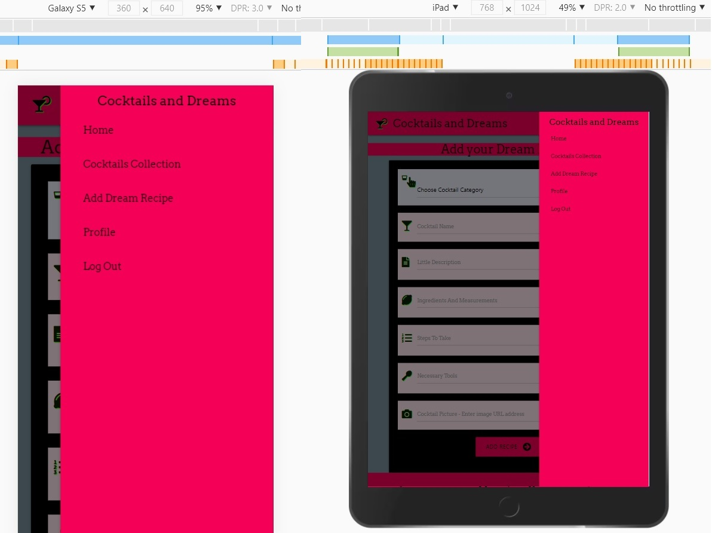

4. **Image Carousel at the Home Page** - has been checked that scrolls right and left direction properly and gives a user visual experience together with the experience of interaction. Users can see the theme of the page during navigation

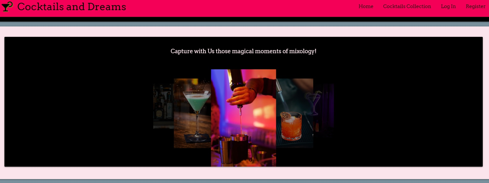

5. **Category dropdown selection at the Home Page** - has been checked that display properly cocktails category name and category description, and all elements are clickable

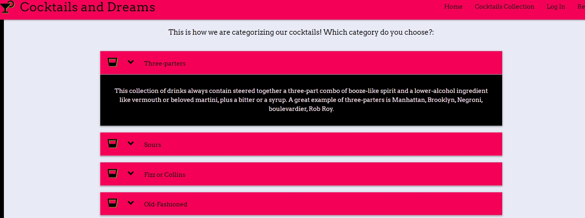

6. **Button nested at the Home Page** - has been checked and ensured that directs the user short way from content to Add Dream Recipe, or alternatively to Log In/Register Page. 
7. **Search bar located at Cocktails Collection Page** - has been checked and ensured that returns results of searching in the database for ingredients and names, if any data were not found then return alert that no result.

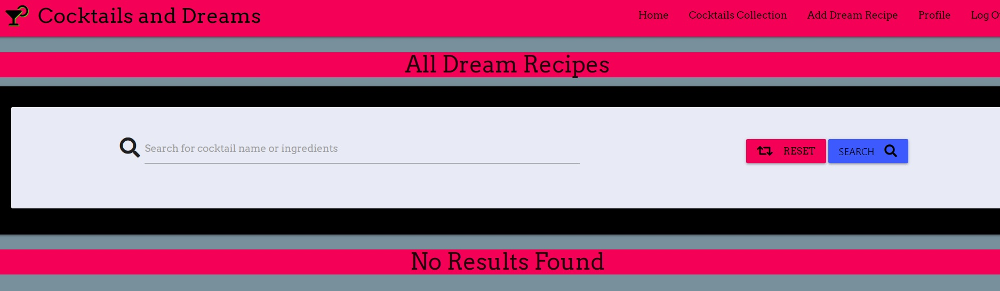

8. **Card Panels with recipes located at Cocktails Collection Page** - has been checked and ensured that returns all planned content like a picture, name, and active buttons for a recipe, as well as a backside with description and other fields described earlier. For logged in users also buttons for edit and delete recipe. 
9. **Profile Page available for registered users** - has been checked and ensured that returns a welcoming message to the user and collection of recipes created by this user/author with all content and functionality. 
10. **Add Dream Recipe Page available for registered users** - has been checked and ensured that displays input fields form ready to being filled up by a user. Clickable categories dropdown menu, and button for add recipe work as it should.  
11. **Edit Dream Recipe Page available for registered users** - has been checked and ensured that displays pre-filled input fields form ready to be updated and edited by a user. Clickable categories dropdown menu, and button for edit recipe work as it should.
12. **Log In Page** - has been checked and ensured that after inserting required data brings a user to the profile page.
13. **Register Page** - has been checked and ensured that after inserting required data brings a user to the profile page.
14. **Log Out** - has been checked and ensured that after clicking on the link takes out a user from the profile page.
15. **Social media icons settled in the footer** - has been checked and ensured that points the user to social media main pages and opens in a new tab.

# Validation of code
When the site developed closer to the final stage, the next test was to check eventually errors in a code validation.
- **HTML** - passing code into The W3C Markup Validation Service brought some warnings that section does not contain header, but it does not cause any problems for the application. 

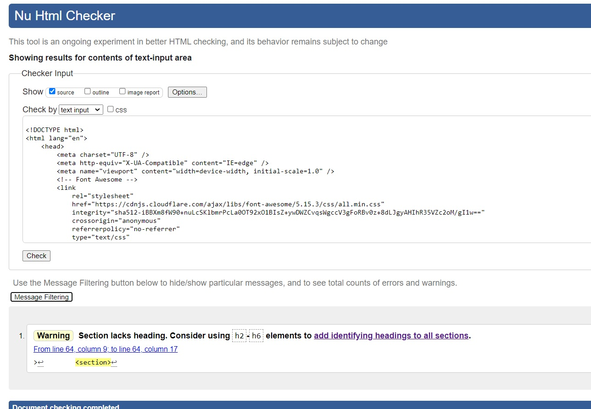
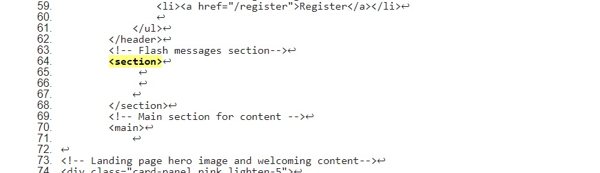

- **CSS** - passing code into The W3C CSS Validation Service - Jigsaw brought no errors.

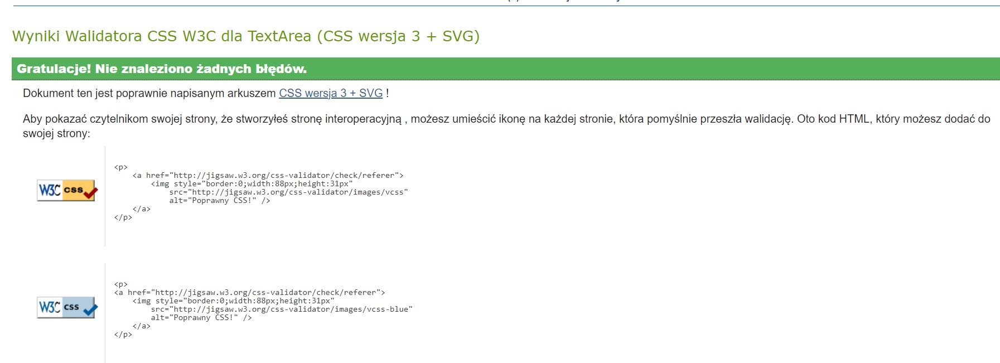

- **Java Script** - passing code to JSHint a static code analysis tool for JavaScript returned some metrics about missing "use strict" statement, despite this, the functionality of code worked for the application.

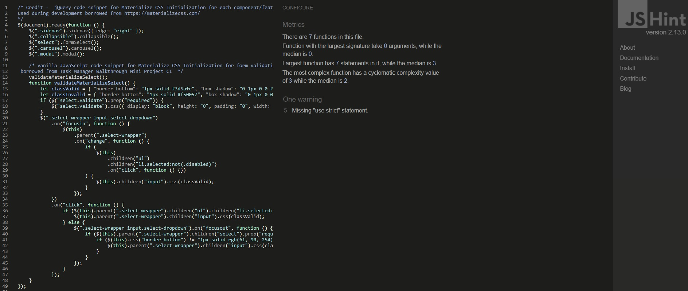

- **PEP8** - check code for PEP8 requirements, passing code into PEP8 online returned no errors, however in the terminal still visible one problem about import env

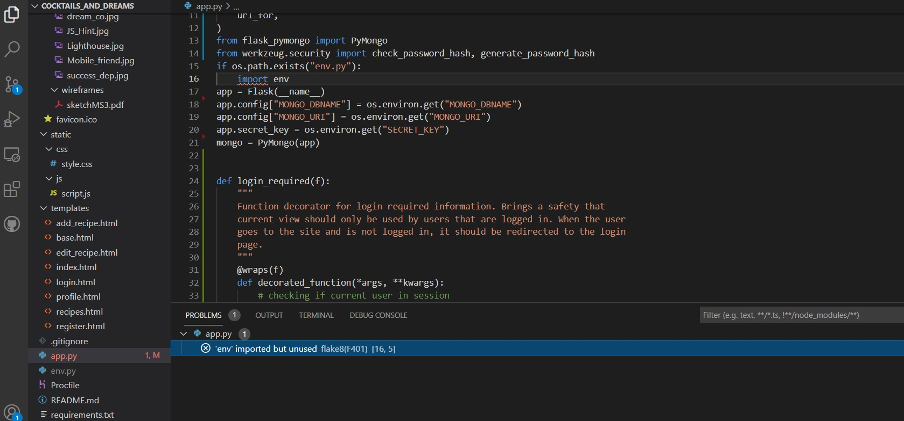

# Other tests on browsers and devices
- **Google Chrome Developer Tools** - The further tests of the application were about to check responsiveness in all pages using devtools. Multiple tests on multiple desktop sizes confirmed that a structure works quite well on mobile devices as well as bigger desktop sizes. The tests were conducted mainly with the use of the Google Chrome browser. However, the research also covered other browsers such as Mozilla Firefox, Microsoft Edge, and Apple Safari. In general, after inspecting by use of the tools available in each browser, it was found that the application displays correctly and is responsive to different screen sizes. 

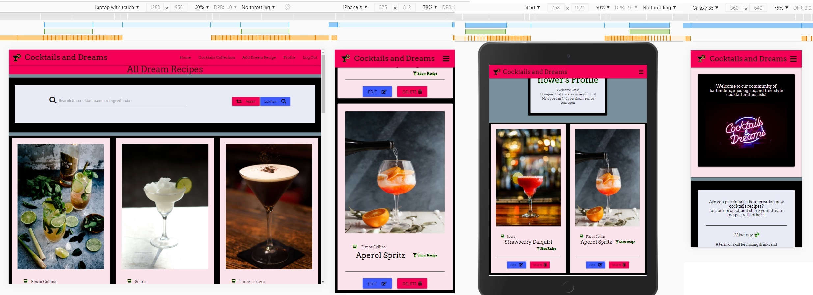

| Browser | Device | Compatibility |
| --- | --- | --- |
| Google Chrome | HP Spectre 13 | no problems occurred |
| Mozilla Firefox | HP Spectre 13 | no problems occurred |
| Microsoft Edge | HP Spectre 13 | no problems occurred |
| Apple Safari | iPad 5th gen | no problems occurred |

- In addition, the test was performed live on devices such as Huawei P20, Samsung Galaxy S10, iPhone 11, iPad 9.7, HP Spectre 13, Asus Zenbook UX32A, iMac. The result was very good and shown that on all those screen devices website was responsive and displayed as expected.

- **Lighthouse web.dev** - Further tests were done by using Lighthouse open source, the performance result was good, no common issues were shown about timing, interactions, accesibility.

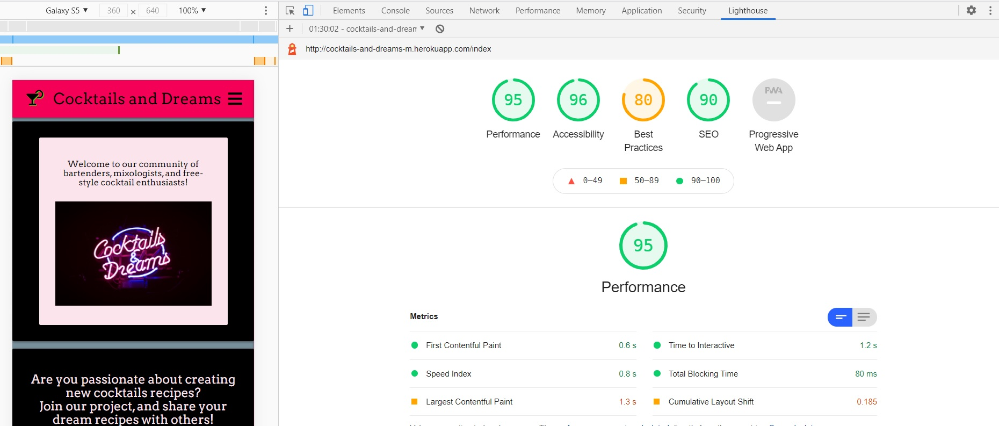

- **Google Mobile-Friendly Test Tool** - Continuing subsequent tests included a test on mobile devices such as mobile phones, the entire application was checked with Google Mobile-Friendly Test Tool and showed that the design is friendly to such devices.

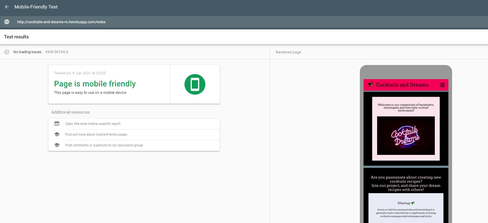

- **Grammarly** - Final tests were about to check grammar and spelling throughout the whole site and Readme file, page by page text was run through Grammarly application and showed several errors to correct.

# User stories 

> Answering to a user story needs: 

- Tests made on the top located navigation bar shown that every person visiting the site will be able to navigate very easily between sections to find pieces of information. Clickable links are bringing the user to different pages. The navigation bar with active links is available all the time on top of the page, so it is easy to switch and back to desirable content.
- Tests made on the separate pages shown that users will be able to learn about the application very fast. The 'Home' - landing page contains very intuitive information and shows the purpose of the website.
- Tests made on the 'Register' page shown that all process is very easy and quick and does not require a lot of data to have access to the full content of the application. Profile account can be created in 3 steps, by entering Username, Password, and click on submit button. 
- Test made on The 'Cocktails Collection' page which presents card panels with separate recipes is very clear and meets the users expectation. Each card panel contains clickable buttons, a picture of the cocktail, name, description, ingredients, tools, and steps. 
- Tests made on footers social media icons allows user to find visible and easy access to social media. Clickable links are giving the user possibility to observe and join the community of bartenders.
- Tests made on different screen sizes show that the application is responsive, so the user can look at the page on different devices.
- Tests made on the 'Log In' page has shown that existing user has very simple access to the full content of the page.  Similar to registration, logging in takes only 3 steps, so makes access very smooth and fast. 
- Tests made on the 'Add Dream Recipe' page shown that users have a great possibility to create and add their own recipes. The page contains a simple form with intuitive icons and input fields, everything is presented clearly so the users can be creative and share ideas not using much time on it. 
- Tests made on the 'Edit' recipe page confirm that registered and logged-in users can easily navigate between their dream recipes.  Authors can edit a recipe, correct the content or category or picture, or just delete it from the collection. 
- Tests made on the 'Profile' page shown that authors of recipes can easily see their own collection of recipes stored in one place. 
- Tests made on the 'Log Out' link confirm that the user can very quickly leave the profile site by clicking on the navbar link. 
    - *Please note that imagery examples that cover testing user stories can be found in the manual and crud testing section.

# CRUD 

- One of the most important part of testing on this application was to ensure that registered user can **Create, Read, Update and Delete** cocktail recipes. So to check that all functionality works as it was planned I created a test user account. 

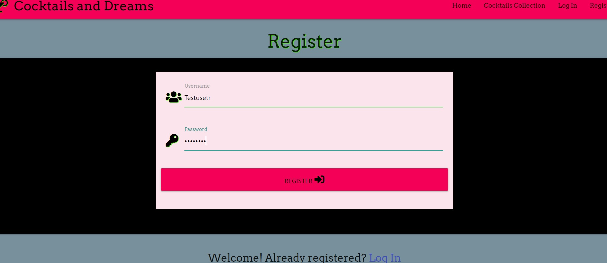

- The **registration** process by entering Userneme and Password required went very easy and smooth and returned a flash message about a successfully created **Profile** page. 

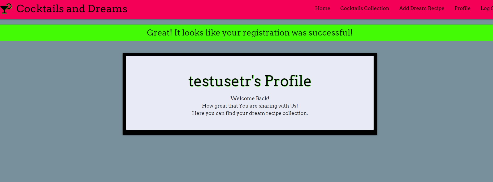

- Once the profile exists user gets full access to the content of the page and the possibility to create new recipes. So next step was to check if **'Add Dream Recipe'** page works properly, I head over to fill the provided form.

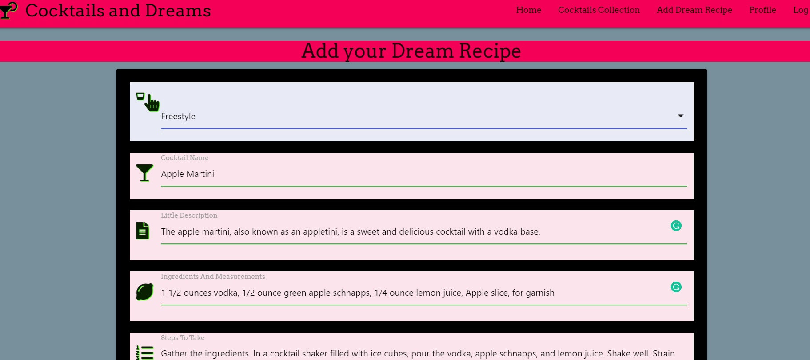

- After clicking on Add Recipe/Submit **button, the recipe was successfully added** to the collection and returned to the page where all recipes are stored.

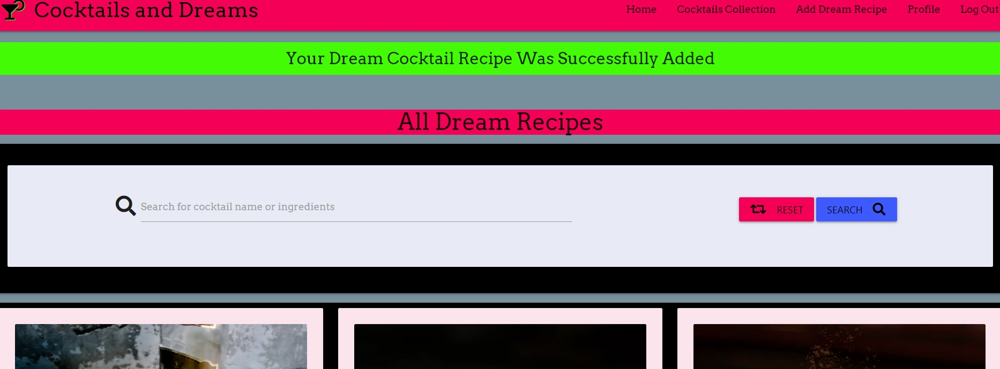

- I made sure that the **card panel with a new recipe** appeared on the page with all collections and on the users profile site. 

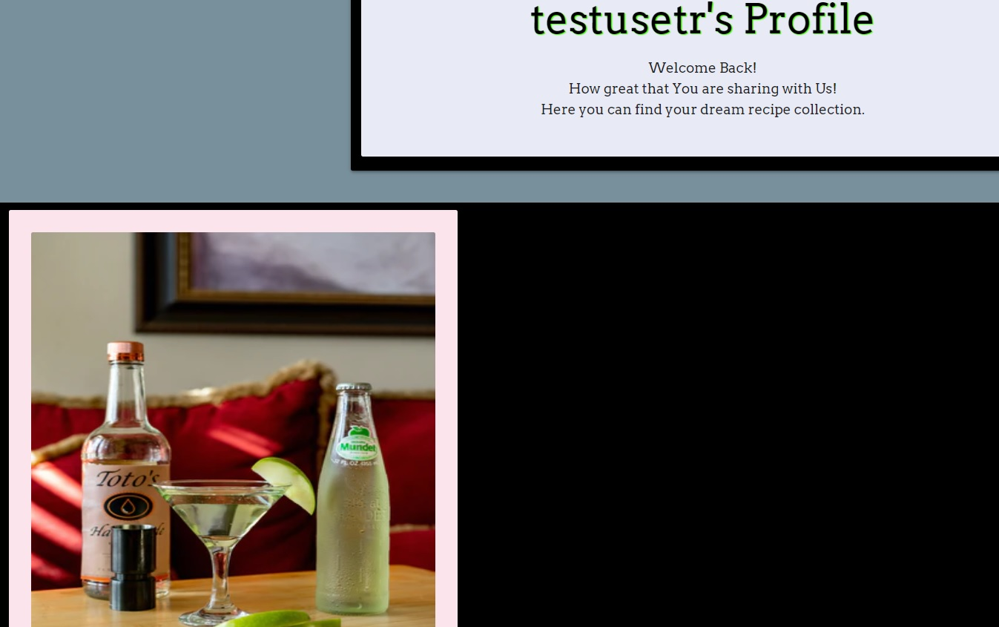

- Then I checked if the **card panel displays all planned features** in front and back, like picture, name, show recipe, close, description, steps, tools, as well as edit and delete buttons.

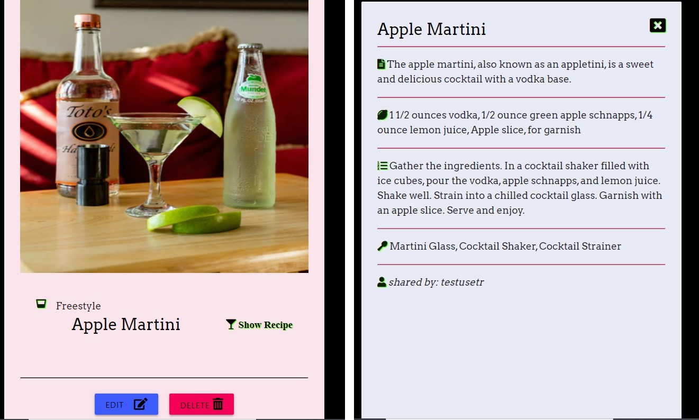

- After everything was looking good I tested the **edit button for a recipe**, after clicking on it I was returned to a **pre-filled form** with the recipe already created. I changed one line with content and I clicked on the edit recipe button, this brought me to the recipe collection page and returned a flash message that my recipe was successfully updated.  

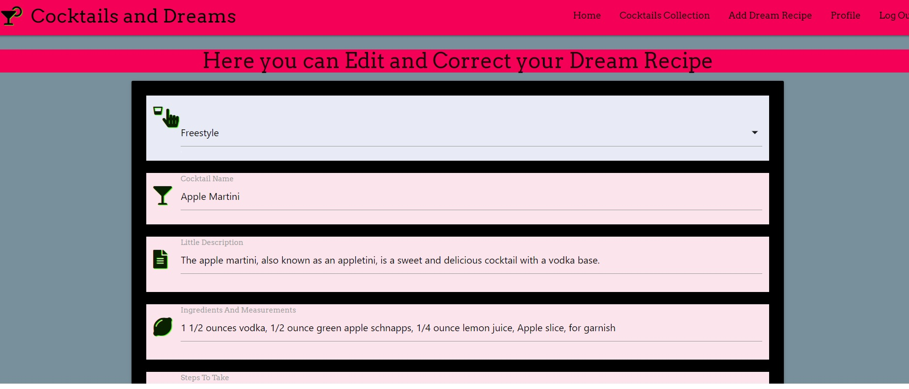

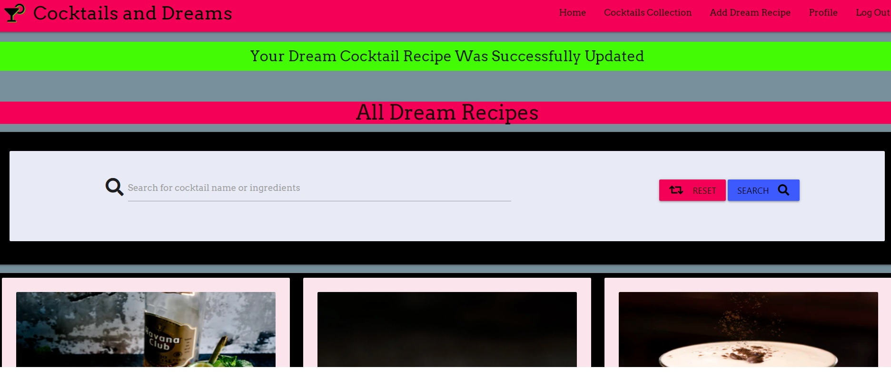

- Then I tested out the **search bar** provided, I entered one of the ingredients of a recipe I wanted to contain, it was the word strawberry which successfully returned cocktail called Strawberry Daiquiri. I made sure that I can see and read other users recipes, browse between them, and search for them by **entering cocktail names or ingredients**. 

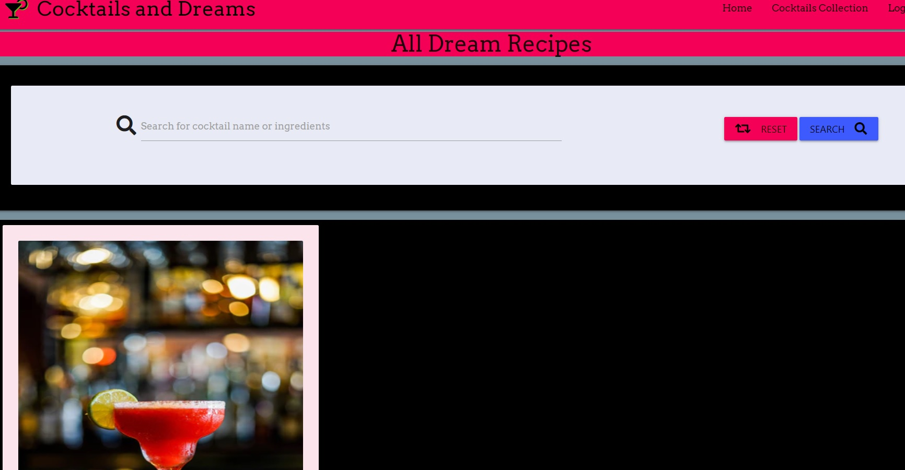

- Then I returned back to the test user profile page and I checked if I can **delete my recipe**. I tested out the button which returned an **alert asking** if I am sure about the deletion of this recipe. I clicked delete and I received an alert that my recipe was deleted from the collection. I checked the page with recipes if this specific one was gone, and it was. 

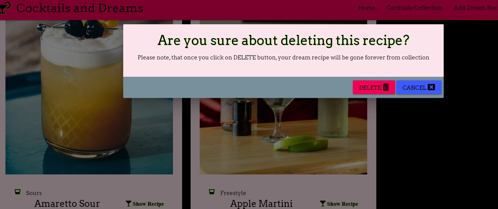

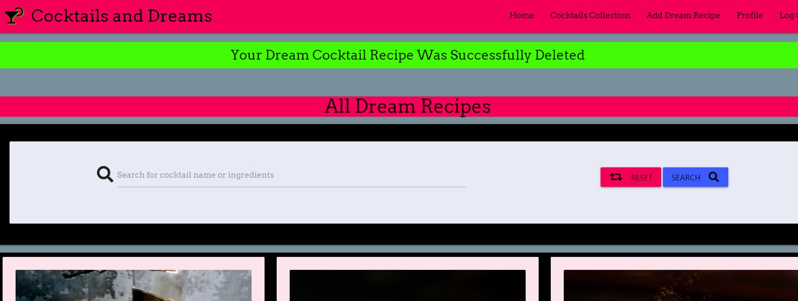

- The last step was to check if the user can safely leave the page, I tested the log-out link provided in the navbar. After clicking on that I received a message that I have been **logged out** and other users do not have access to my creations. 

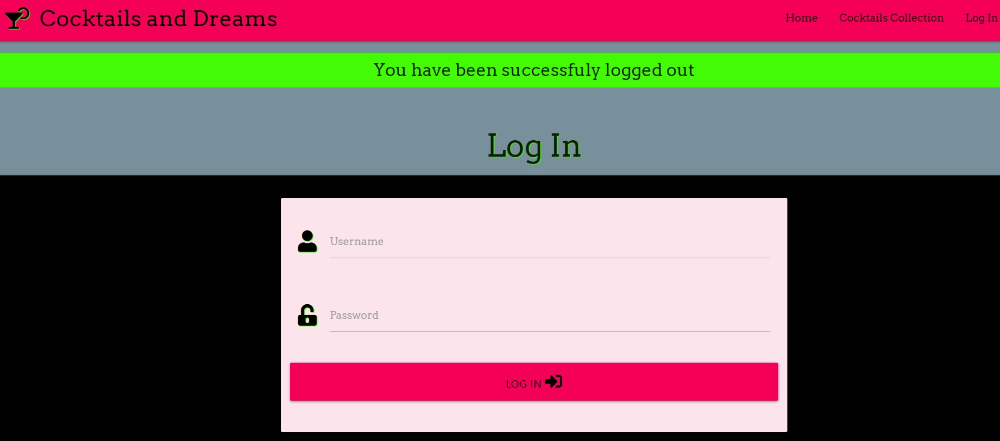

**The above tests confirm that the application fulfills its task and registered and logged-in users can read, create, edit and delete recipes.**

# Debug mode

