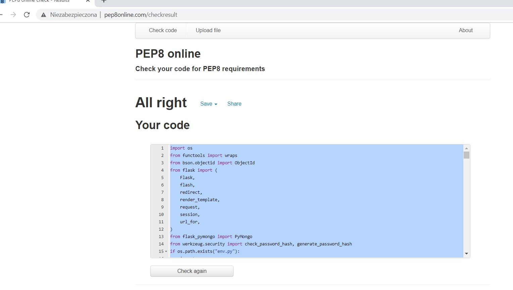

# Manual testing on features

The first step of the testing process was to create a repository with the basic framework of this application and check if the attached links for navigation between pages work properly. Then the application was deployed and developed successively, step by step and page by page. During the development process, all the features were checked after they were included. Last proper manual testing included one more detailed checking if everything works as expected.

1. **Brand name link and Home link** - has been checked and confirmed that directs the user successfully to the Home page.
2. **All links settled in the top navigation bar** - have been checked that allow the user to navigate between individual pages like Home, Cocktail Collection, Register, Log In, Add Dream Recipe, Profile, Log Out.
3. **All links settled in the side navigation bar for mobile** - also have been checked that allow the user to navigate between individual pages.
4. **Image Carousel at the Home Page** - has been checked that scrolls right and left direction properly and gives a user visual experience together with the experience of interaction. Users can see the theme of the page during navigation
5. **Category dropdown selection at the Home Page** - has been checked that display properly cocktails category name and category description, and all elements are clickable and 
6. **Button nested at the Home Page** - has been checked and ensured that directs the user short way from content to Add Dream Recipe, or alternatively to Log In/Register Page. 
7. **Search bar located at Cocktails Collection Page** - as been checked and ensured that returns results of searching in the database for ingredients and names, if any data were not found then return alert that no result.
8. **Card Panels with recipes located at Cocktails Collection Page** - has been checked and ensured that returns all planned content like a picture, name, and active buttons for a recipe, as well as a backside with description and other fields described earlier. For logged in users also buttons for edit and delete recipe. 
9. **Profile Page available for registered users** - has been checked and ensured that returns a welcoming message to the user and collection of recipes created by this user/author with all content and functionality. 
10. **Add Dream Recipe Page available for registered users** - has been checked and ensured that displays input fields form ready to being filled up by a user. Clickable categories dropdown menu, and button for add recipe work as it should.  
11. **Edit Dream Recipe Page available for registered users** - has been checked and ensured that displays pre-filled input fields form ready to be updated and edited by a user. Clickable categories dropdown menu, and button for edit recipe work as it should.
12. **Log In Page** - has been checked and ensured that after inserting required data brings a user to the profile page.
13. **Register Page** - has been checked and ensured that after inserting required data brings a user to the profile page.
14. **Log Out** - has been checked and ensured that after clicking on the link takes out a user from the profile page.
15. **Social media icons settled in the footer** - has been checked and ensured that points the user to social media main pages and opens in a new tab.

# Validation 
When the site developed closer to the final stage, the next test was to check eventually errors in a code validation.
- **HTML** - passing code into The W3C Markup Validation Service brought some warnings, 

- **CSS** - passing code into The W3C CSS Validation Service - Jigsaw brought no errors.

- **Java Script** - passing code to JSHint a static code analysis tool for JavaScript returned some metrics about missing "use strict" statement, despite this, the functionality of code worked for the application.

- **PEP8** - check code for PEP8 requirements, passing code into PEP8 online returned no errors, however in the terminal still visible one problem about import env

# Other Tests
- **Google Chrome Developer Tools** - The further tests of the application were about to check responsiveness in all pages using devtools. Multiple tests on multiple desktop sizes confirmed that a structure works quite well on mobile devices as well as bigger desktop sizes. The tests were conducted mainly with the use of the Google Chrome browser. However, the research also covered other browsers such as Mozilla Firefox, Microsoft Edge, and Apple Safari. In general, after inspecting by use of the tools available in each browser, it was found that the application displays correctly and is responsive to different screen sizes. 

| Browser | Device | Compatibility |
| --- | --- | --- |
| Google Chrome | HP Spectre 13 | no problems occurred |
| Mozilla Firefox | HP Spectre 13 | no problems occurred |
| Microsoft Edge | HP Spectre 13 | no problems occurred |
| Apple Safari | iPad 5th gen | no problems occurred |

- In addition, the test was performed live on devices such as Huawei P20, Samsung Galaxy S10, iPhone 11, iPad 9.7, HP Spectre 13, Asus Zenbook UX32A, iMac. The result was very good and shown that on all those screen devices website was responsive and displayed as expected.

- **Lighthouse web.dev** - Further tests were done by using Lighthouse open source, the performance result was good, no common issues were shown about timing, interactions, accesibility.

- **Google Mobile-Friendly Test Tool** - Continuing subsequent tests included a test on mobile devices such as mobile phones, the entire application was checked with Google Mobile-Friendly Test Tool and showed that the design is friendly to such devices.

- **Grammarly** - Final tests were about to check grammar and spelling throughout the whole site and Readme file, page by page text was run through Grammarly application and showed several errors to correct.

